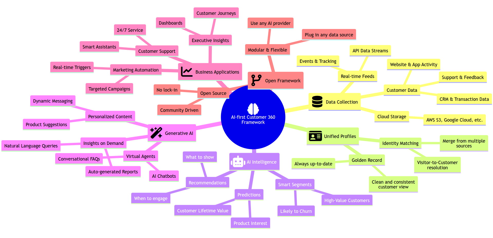

# ReSynap

**Open Source AI-first Customer 360 Framework**




## 🔑 Core Features of ReSynap Framework

* **Unified Customer Profile:** Combines customer data from all sources into one clear profile.
* **Smart Identity Matching:** Uses AI to merge duplicate profiles and link anonymous users to known ones.
* **Real-Time Data Handling:** Tracks and processes customer actions instantly.
* **Built-in AI/ML Tools:** Supports predictive models like churn risk, lifetime value, and customer segments.
* **Customer Knowledge Graph:** Maps relationships between people, products, and behaviors for deeper insights.
* **Generative AI Integration:** Connects with ChatGPT, Gemini, and others to power chatbots, summaries, and content.
* **Modular & Open Source:** Easy to customize, extend, and plug in different tools or databases.
* **Scalable Infrastructure:** Handles big data and AI workloads with distributed storage and compute.
* **APIs for Activation:** Offers APIs to pull insights and trigger actions in tools like CRMs and marketing platforms.
* **Data Privacy & Security:** Built-in features for consent, data protection, and compliance (e.g., GDPR, CCPA).

## 🚀 Real-World Use Cases

* **Personalization at Scale:** Tailors content and offers across all channels in real-time.
* **Smarter Customer Support:** Gives agents full context and predicts issues before they happen.
* **Dynamic Segmentation:** Builds live customer groups based on behavior and predictions.
* **Churn Prevention:** Spots customers likely to leave and auto-triggers retention offers.
* **CLV Growth:** Predicts customer value and helps focus on high-potential relationships.
* **AI Chatbots:** Delivers personalized, context-aware conversations powered by C360 data.
* **Journey Automation:** Builds smart customer flows that adapt in real-time.
* **Next Best Action:** Recommends the most relevant content, offer, or step for each user.
* **Fraud Detection:** Flags unusual behavior using AI and behavior analytics.
* **Voice of Customer Insights:** Analyzes feedback with AI to uncover trends and sentiments.

## Getting Started

1. **Installation**: [TODO]
2. **Usage**: [TODO]
3. **API Integration**: [TODO]

## Contributions

Contributions to ReSynap are welcome! Please follow the [contribution guidelines](link to contribution guidelines) and submit your pull requests.

---

With ReSynap, transform data and text into actionable, visual insights and automate your workflows seamlessly!

## System requirements

- Python 3.10+
- FastAPI
- Pydantic
- Qdrant Vector Database. Refer to the Qdrant documentation for instructions: https://qdrant.tech/documentation/quick-start/
- Qdrant client library (install with `pip install qdrant-client`)
- PostgreSQL for customer 360 database
- Redis or Apache Kafka for data processing on queue
- Large language models (LLMs) likes Google Gemini or OpenAI   

## Installation

1. Clone the repository:
```bash
   git clone https://github.com/trieu/resynap
```

2. Create env
```bash
    python -m venv env
    source env/bin/activate
```

3. Install the dependencies:
```bash
   python -m pip install --upgrade pip
   pip install -r requirements.txt
```

4. Start the Qdrant server:
```bash
   ./start_qdrant.sh
```

5. Next, create a .env file by coping the file sample.env or create your own file with content:
```
    # Customer 360 configuration

    # Chatbot configuration
    CHATBOT_NAME=AI Buddy
    CHATBOT_DEV_MODE=true
    CHATBOT_HOSTNAME=chatbot.example.com
    DEFAULT_AUTHORIZATION_KEY=personalization_test
    EMBEDDING_MODEL_NAME=intfloat/multilingual-e5-small

    # GOOGLE cloud configuration
    GOOGLE_APPLICATION_CREDENTIALS=
    GOOGLE_SERVICE_ACCOUNT_JSON=

    # GEMINI model configuration
    GEMINI_TEXT_MODEL_ID=gemini-2.0-flash-lite
    GEMINI_IMAGE_MODEL_ID=imagen-3.0-generate-002
    GEMINI_API_KEY=

    # Google 
    GOOGLE_SEARCH_ENGINE_ID=
    GOOGLE_SEARCH_API_KEY=

    # AWS configuration
    AWS_ACCESS_KEY_ID=
    AWS_SECRET_ACCESS_KEY=
    AWS_REGION=
    AWS_S3_BUCKET_PUBLIC=

    # Qdrant dev configuration
    QDRANT_HOST=localhost
    QDRANT_PORT=6333

    # Qdrant cloud configuration
    QDRANT_CLOUD_HOST=
    QDRANT_CLOUD_API_KEY=

    # API configuration
    API_HOST=0.0.0.0
    API_PORT=8000

    # Redis configuration
    REDIS_HOST=localhost
    REDIS_PORT=6380

    # PostgreSQL configuration
    PG_HOST=localhost 
    PG_PORT=5433 
    PG_DATABASE=customer360
    PG_USER=
    PG_PASSWORD=

    # Airflow configuration
    AIRFLOW_BASE_URL=http://localhost:8080/api/v1
    AIRFLOW_USERNAME=
    AIRFLOW_PASSWORD=
```


## API Endpoints

    All API Endpoints must be called with the header: Authorization = [your_api_key]
    The [your_api_key] must be in Redis. E.g: 127.0.0.1:6480> set personalization_test true

### Profiles

- **`POST /add-profile/`**
    - Adds a single user profile to the database.
    - Request body: `ProfileRequest` object (see below)
    - Response: `{"status": "Profile added successfully"}`
- **`POST /add-profiles/`**
    - Adds multiple user profiles to the database in bulk.
    - Request body: List of `ProfileRequest` objects 
    - Response: `{"status": "All profiles added successfully"}`
- **`POST /check-profile-for-recommendation/`**
    - Add or update a profile, then  get real-time recommendations for the profile
    - Request body: `ProfileRequest` object
    - Response: List of recommended products (see example below)

### Products

The product management API

- **`POST /add-product/`**
    - Adds a single product to the database.
    - Request body: `ProductRequest` object (see below)
    - Response: `{"status": "Product added successfully"}`
- **`POST /add-products/`**
    - Adds multiple products to the database in bulk.
    - Request body: List of `ProductRequest` objects
    - Response: `{"status": "All products added successfully"}`

### Contents

The content management API

- **`POST /add-content/`**
    - Adds a single content item to the database.
    - Request body: `ContentRequest` object (see below)
    - Response: `{"status": "Content item added successfully"}`
- **`POST /add-contents/`**
    - Adds multiple content items to the database in bulk.
    - Request body: List of `ContentRequest` objects
    - Response: `{"status": "All content items added successfully"}`

### Recommendations

The recommendation API to personalize product, contents and both.

- **`GET /recommend/{profile_id}`**
    - Gets personalized product recommendations for a given profile ID.
    - Path parameters:
        - `profile_id`: The ID of the user profile.
        - `item_type`: The item type to get recommendation: product, content, or both.
    - Query parameters:
        - `top_n` (optional): The maximum number of recommendations to return (default: 8).
        - `except_product_ids` (optional): Comma-separated string of product IDs to exclude from 
        - `except_content_ids` (optional): Comma-separated string of content IDs to exclude from recommendations (e.g., "item_1,item_3").
    - Response: List of recommended product / content IDs (see example below)

## Data Models

**ProfileRequest:**

```json
{
    "profile_id": "crm_11",
    "page_view_keywords": [
        "car",
        "bike",
        "accessories"
    ],
    "purchase_keywords": [
        "helmet",
        "gloves"
    ],
    "interest_keywords": [
        "travel",
        "photography",
        "outdoors"
    ],
    "additional_info": {
        "age": 28,
        "location": "Germany"
    }
}
```

**ProductRequest:**

```json
{
    "product_id": "item_1",
    "product_name": "Macbook Pro",
    "product_category": "Electronics",
    "product_keywords": ["tech", "work", "portable"],
    "additional_info": {"brand": "Apple", "price": 1200}
}
```

**ContentRequest:**

```json
{
    "content_id": "item_1",
    "title": "Macbook Pro",
    "content_category": "Electronics",
    "content_keywords": ["tech", "work", "portable"]
}
```

## Example Usage

### Adding a Profile

```bash
curl -X POST \
  http://localhost:8000/add-profile/ \
  -H 'Content-Type: application/json' \
  -H 'Authorization: personalization_test' \
  -d '{
    "profile_id": "crm_15",
    "page_view_keywords": [
      "car",
      "bike",
      "accessories"
    ],
    "purchase_keywords": [
      "helmet",
      "gloves"
    ],
    "interest_keywords": [
      "travel",
      "photography",
      "outdoors"
    ],
    "additional_info": {
      "age": 28,
      "location": "Germany"
    }
  }'
```
### Getting Recommendations

```bash
curl -X GET \
  -H 'Authorization: personalization_test' \
  "http://localhost:8000/recommend/crm_15?top_n=5&except_product_ids=item_1,item_6" 
```

## Future Improvements

- Implement more sophisticated vectorization techniques for user profiles and product data. 
- Add support for more advanced filtering and ranking options for recommendations.
- Integrate with a user interface for managing profiles and products.