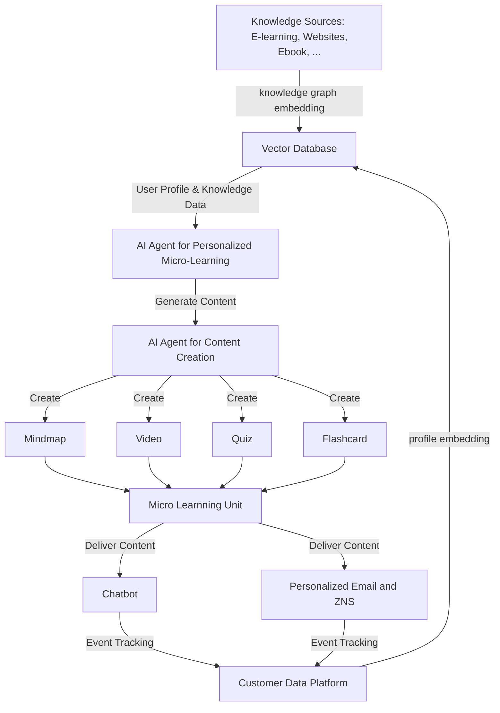

# Flow of Micro Learning with AI

```mermaid 
graph TD;
    A[Knowledge Sources: <br> E-learning, Websites, Ebook, ...] -->|knowledge graph embedding| B[Vector Database];
    P[Customer Data Platform] -->|profile embedding| B[Vector Database];
    B -->|User Profile & Knowledge Data| C[AI Agent for Personalized Micro-Learning];
    C -->|Generate Content| D[AI Agent for Content Creation];
    D -->|Create| D1[Mindmap];
    D -->|Create| D2[Video];
    D -->|Create| D3[Quiz];
    D -->|Create| D4[Flashcard];
    
    
    D1 --> E[Micro Learnning Unit];
    D2 --> E;
    D3 --> E;
    D4 --> E;
    
    E -->|Deliver Content| F[Chatbot];
    E -->|Deliver Content| G[Personalized Email and ZNS];
    F -->|Event Tracking| P;
    G -->|Event Tracking| P;
```