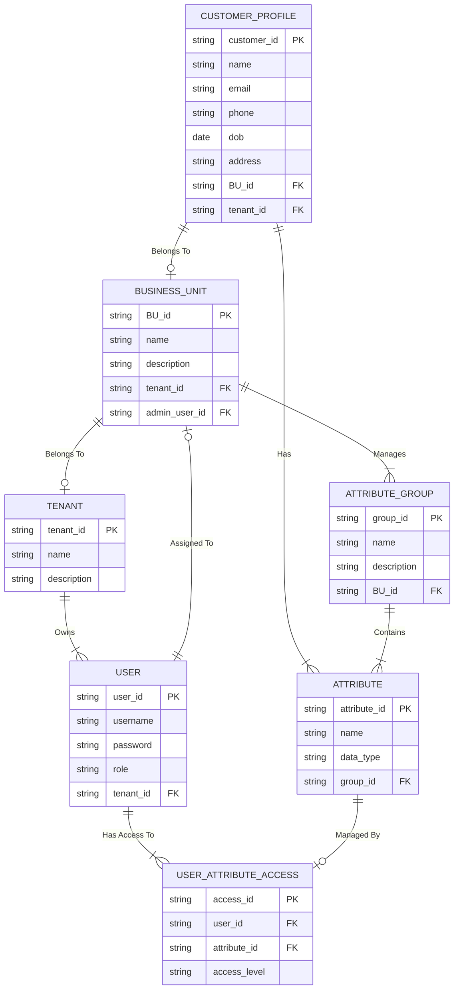

### 📚 **Thiết Kế JSON Schema cho ArangoDB (Multi-Tenant Customer360 )**

ArangoDB là cơ sở dữ liệu đa mô hình, hỗ trợ document, graph, và key-value. Dưới đây là thiết kế schema theo dạng JSON mẫu phù hợp với ArangoDB, tối ưu cho **Multi-Tenant Customer360 **.

---

## 🛠️ **1. Collection: Tenants**

```json
{
  "_key": "tenant_001",
  "name": "NovaCorp",
  "description": "Multi-brand food and beverage corporation",
  "created_at": "2024-06-01T10:00:00Z"
}
```

- **_key:** Mã định danh duy nhất của Tenant.  
- **name:** Tên của Tenant.  
- **description:** Mô tả chi tiết về Tenant.  
- **created_at:** Thời gian tạo Tenant.

---

## 🛠️ **2. Collection: BusinessUnits**

```json
{
  "_key": "bu_001",
  "name": "Nova Coffee",
  "description": "Premium coffee brand",
  "tenant_id": "tenant_001",
  "admin_user_id": "user_001",
  "created_at": "2024-06-01T10:10:00Z"
}
```

- **_key:** Mã định danh của Business Unit (BU).  
- **name:** Tên của BU.  
- **description:** Mô tả BU.  
- **tenant_id:** Liên kết với Tenant.  
- **admin_user_id:** ID người dùng quản trị BU.  
- **created_at:** Thời gian tạo BU.

---

## 🛠️ **3. Collection: Users**

```json
{
  "_key": "user_001",
  "username": "admin_novacoffee",
  "role": "BU_ADMIN",
  "tenant_id": "tenant_001",
  "BU_id": "bu_001",
  "email": "admin@novacoffee.com",
  "created_at": "2024-06-01T10:15:00Z"
}
```

- **_key:** Mã định danh người dùng.  
- **username:** Tên đăng nhập.  
- **role:** Vai trò người dùng (`TENANT_ADMIN`, `BU_ADMIN`, `USER`).  
- **tenant_id:** Thuộc Tenant nào.  
- **BU_id:** Thuộc Business Unit nào.  
- **email:** Email người dùng.  
- **created_at:** Thời gian tạo tài khoản.

---

## 🛠️ **4. Collection: CustomerProfiles**

```json
{
  "_key": "cust_001",
  "name": "John Doe",
  "email": "john.doe@example.com",
  "phone": "+123456789",
  "dob": "1990-01-15",
  "address": "123 Main St, City, Country",
  "tenant_id": "tenant_001",
  "BU_id": "bu_001",
  "attributes": {
    "loyalty_points": 1500,
    "last_purchase": "2024-05-15"
  },
  "created_at": "2024-06-01T10:20:00Z"
}
```

- **_key:** Mã định danh khách hàng.  
- **name:** Tên khách hàng.  
- **email:** Email khách hàng.  
- **phone:** Số điện thoại khách hàng.  
- **dob:** Ngày sinh khách hàng.  
- **address:** Địa chỉ khách hàng.  
- **tenant_id:** Liên kết Tenant.  
- **BU_id:** Liên kết BU.  
- **attributes:** Dữ liệu linh hoạt cho từng profile.  
- **created_at:** Thời gian tạo profile.

---

## 🛠️ **5. Collection: AttributeGroups**

```json
{
  "_key": "attrgroup_001",
  "name": "Personal Information",
  "description": "Contains personal attributes",
  "BU_id": "bu_001",
  "created_at": "2024-06-01T10:25:00Z"
}
```

- **_key:** Mã định danh nhóm thuộc tính.  
- **name:** Tên nhóm thuộc tính.  
- **description:** Mô tả nhóm thuộc tính.  
- **BU_id:** Thuộc về BU nào.  
- **created_at:** Thời gian tạo.

---

## 🛠️ **6. Collection: Attributes**

```json
{
  "_key": "attr_001",
  "name": "loyalty_points",
  "data_type": "integer",
  "group_id": "attrgroup_001",
  "BU_id": "bu_001"
}
```

- **_key:** Mã định danh thuộc tính.  
- **name:** Tên thuộc tính.  
- **data_type:** Loại dữ liệu (`string`, `integer`, `date`).  
- **group_id:** Nhóm thuộc tính.  
- **BU_id:** Thuộc BU nào.

---

## 🛠️ **7. Collection: UserAttributeAccess**

```json
{
  "_key": "access_001",
  "user_id": "user_001",
  "attribute_id": "attr_001",
  "access_level": "read"
}
```

- **_key:** Mã định danh quyền truy cập.  
- **user_id:** ID người dùng.  
- **attribute_id:** ID thuộc tính được cấp quyền.  
- **access_level:** Quyền truy cập (`read`, `write`, `view`).

---

## 📊 **8. Edge Collections (Graph Relationship)**

### **Tenant → Business Unit**
```json
{
  "_from": "Tenants/tenant_001",
  "_to": "BusinessUnits/bu_001",
  "type": "MANAGES"
}
```

### **Business Unit → Customer Profile**
```json
{
  "_from": "BusinessUnits/bu_001",
  "_to": "CustomerProfiles/cust_001",
  "type": "OWNS"
}
```

### **User → Attribute Access**
```json
{
  "_from": "Users/user_001",
  "_to": "Attributes/attr_001",
  "type": "HAS_ACCESS"
}
```

---

## 🔑 **Graph Representation**

- **Graph Name:** `MultiTenantCDP`
- **Vertices:**  
   - `Tenants`  
   - `BusinessUnits`  
   - `Users`  
   - `CustomerProfiles`  
   - `Attributes`  
- **Edges:**  
   - `MANAGES` (Tenant → BU)  
   - `OWNS` (BU → CustomerProfile)  
   - `HAS_ACCESS` (User → Attribute)

---

## 📈 **Lợi Ích của Thiết Kế Multi-Tenant trong ArangoDB**

1. **Phân quyền rõ ràng:** Mỗi BU và User chỉ truy cập vào dữ liệu của mình.  
2. **Mở rộng dễ dàng:** Tenant mới, BU mới, User mới có thể thêm mà không ảnh hưởng cấu trúc hiện tại.  
3. **Tối ưu Query:** Graph model giúp dễ dàng truy vấn mối quan hệ phức tạp.  
4. **An ninh dữ liệu:** Quản lý truy cập chi tiết thông qua `UserAttributeAccess`.

---

Schema này cung cấp mô hình linh hoạt, rõ ràng cho Customer360  Multi-Tenant, đồng thời tận dụng khả năng lưu trữ document và graph của ArangoDB để đạt hiệu suất và khả năng mở rộng cao.


```json
{
  "Tenant": {
    "tenant_id": "string",
    "name": "string",
    "description": "string",
    "users": [
      {
        "user_id": "string",
        "username": "string",
        "password": "string",
        "role": "string"
      }
    ],
    "business_units": [
      {
        "BU_id": "string",
        "name": "string",
        "description": "string",
        "admin_user_id": "string",
        "customer_profiles": [
          {
            "customer_id": "string",
            "name": "string",
            "email": "string",
            "phone": "string",
            "dob": "date",
            "address": "string",
            "attributes": [
              {
                "attribute_id": "string",
                "name": "string",
                "data_type": "string",
                "group_id": "string"
              }
            ]
          }
        ],
        "attribute_groups": [
          {
            "group_id": "string",
            "name": "string",
            "description": "string",
            "attributes": [
              {
                "attribute_id": "string",
                "name": "string",
                "data_type": "string"
              }
            ]
          }
        ]
      }
    ]
  },
  "User_Attribute_Access": [
    {
      "access_id": "string",
      "user_id": "string",
      "attribute_id": "string",
      "access_level": "string"
    }
  ]
}
```

### 📝 **Giải thích JSON Schema:**

1. **Tenant:**  
   - Đại diện cho mỗi khách hàng sử dụng hệ thống CDP.  
   - Chứa thông tin người dùng (Admin, User) và các Business Unit (BU).  

2. **User:**  
   - Mỗi `Tenant` có danh sách người dùng riêng, bao gồm: `user_id`, `username`, `role`.  

3. **Business_Units:**  
   - Mỗi Tenant có thể có nhiều BU độc lập.  
   - Mỗi BU có một `admin_user_id` chịu trách nhiệm quản trị.  

4. **Customer_Profiles:**  
   - Mỗi BU có danh sách khách hàng riêng với thông tin chi tiết: `name`, `email`, `phone`, `dob`.  
   - Mỗi khách hàng có thể có nhiều thuộc tính (`attributes`).  

5. **Attribute_Groups:**  
   - Các thuộc tính của khách hàng được nhóm lại theo `attribute_groups`.  
   - Ví dụ: Thông tin cá nhân, Lịch sử mua hàng.

6. **Attributes:**  
   - Là chi tiết từng thuộc tính trong mỗi `attribute_group`.  
   - Bao gồm: `attribute_id`, `name`, `data_type`.

7. **User_Attribute_Access:**  
   - Quản lý quyền truy cập chi tiết của mỗi người dùng vào từng thuộc tính cụ thể.  
   - Ví dụ: Quyền đọc (`read`), ghi (`write`), chỉ xem (`view`).  

### 🔑 **Quyền Quản Lý:**
- **Tenant Admin:** Quản lý toàn bộ Tenant và BU.  
- **BU Admin:** Quản lý dữ liệu khách hàng trong BU.  
- **User:** Truy cập và thao tác dữ liệu theo quyền được cấp (`User_Attribute_Access`).  

JSON Schema này cung cấp cấu trúc rõ ràng, dễ dàng mở rộng, và phù hợp với kiến trúc multi-tenant, giúp đảm bảo tính độc lập và bảo mật giữa các Business Unit trong CDP.

```markdown

``` 

### 📝 **Giải thích schema:**

1. **TENANT:**  
   - Đại diện cho từng khách hàng sử dụng hệ thống CDP.  
   - Mỗi Tenant có thể bao gồm nhiều **Business Unit (BU)**.  

2. **BUSINESS_UNIT:**  
   - Mỗi BU đại diện cho một đơn vị kinh doanh trong Tenant.  
   - Mỗi BU có **BU Admin** chịu trách nhiệm quản lý dữ liệu.  

3. **CUSTOMER_PROFILE:**  
   - Lưu trữ thông tin khách hàng thuộc về một BU cụ thể.  
   - Dữ liệu được phân quyền theo BU để đảm bảo bảo mật.

4. **ATTRIBUTE_GROUP:**  
   - Cho phép tổ chức dữ liệu khách hàng thành các nhóm thuộc tính (e.g., Thông tin cá nhân, Lịch sử mua hàng).  
   - Gắn liền với BU.

5. **ATTRIBUTE:**  
   - Mô tả các thuộc tính cụ thể (e.g., name, email, phone).  
   - Thuộc về một nhóm thuộc tính cụ thể.

6. **USER:**  
   - Đại diện cho người dùng đăng nhập (BU Admin, Data Analyst, etc.).  
   - Phân quyền truy cập đến từng thuộc tính dữ liệu.

7. **USER_ATTRIBUTE_ACCESS:**  
   - Xác định quyền truy cập của mỗi User đối với từng thuộc tính dữ liệu.  
   - Ví dụ: Quyền đọc, ghi, hoặc chỉ xem.

### 🔑 **Quyền hạn cụ thể:**
- **Tenant Admin:** Quản lý toàn bộ Tenant và các BU bên trong.  
- **BU Admin:** Quản lý dữ liệu và người dùng trong một BU.  
- **User:** Truy cập và thao tác dữ liệu dựa trên quyền hạn được cấp qua **USER_ATTRIBUTE_ACCESS**.

Schema này hỗ trợ multi-tenant CDP, đảm bảo mỗi BU hoạt động độc lập, an toàn, và phân quyền chi tiết đến từng thuộc tính dữ liệu.