#  Customer 360 - Entity Identity Resolution

```mermaid
erDiagram

    cdp_raw_profiles_stage {
        UUID raw_profile_id PK "ID duy nhất cho raw profile"
        string tenant_id "ID của Tenant (khách hàng sử dụng CDP)"
        string source_system "Hệ thống nguồn của bản ghi"
        timestamp_tz received_at "Timestamp when record was received"
        smallint status_code "valid value: 3=processed, 2=in-progress, 1=active/unprocessed, 0=deactivated, -1=delete"
        string_citext email "Sử dụng kiểu citext cho email để tìm kiếm không phân biệt chữ hoa/thường"
        string phone_number "Cần chuẩn hóa số điện thoại"
        string web_visitor_id "Web Visitor ID (từ cookie hoặc tracking script)"
        string crm_contact_id "ID contact CRM chính hoặc đã được hợp nhất (nếu có)"
        string crm_source_id "ID của bản ghi hồ sơ gốc từ hệ thống CRM nguồn cụ thể"
        string social_user_id "Zalo User ID, Facebook User ID, Google User ID,..."
        string first_name "field mặc định name của profile. VD: 'Nguyen Van An hay 'Van An' đều OK"
        string last_name "theo chuẩn quốc tế"
        string gender "ví dụ: 'male', 'female', 'unknown',..."
        date date_of_birth
        string address_line1 "temporary residence address (tạm trú)"
        string address_line2 "permanent address (Địa chỉ thướng trú)"
        string city
        string state
        string zip_code
        string country
        double latitude "get from mobile app geolocation API"
        double longitude "get from mobile app geolocation API"
        string preferred_language "Ngôn ngữ ưa thích, ví dụ: 'vi', 'en'"
        string preferred_currency "Tiền tệ ưa thích, ví dụ: 'VND', 'USD'"
        jsonb preferred_communication "Tùy chọn liên lạc ưa thích, ví dụ: { 'email': true, 'sms': false, 'zalo': true }"
        timestamp_tz last_seen_at "Thời gian sự kiện cuối cùng được ghi nhận"
        string last_seen_observer_id "ID của event observer cuối cùng khi quan sát hành vi user"
        string last_seen_touchpoint_id "ID của điểm chạm (touchpoint) cuối cùng"
        string last_seen_touchpoint_url "URL của điểm chạm (touchpoint) cuối cùng"
        string last_known_channel "Kênh tương tác cuối cùng, ví dụ: 'web', 'mobile', 'app', 'retail_store',..."
        jsonb ext_attributes "Trường dữ liệu mở rộng dưới dạng JSONB"
        timestamp_tz updated_at "thời gian cuối cùng mà profile đã được xử lý"
    }

    cdp_master_profiles {
        UUID master_profile_id PK "ID duy nhất cho hồ sơ master"
        string tenant_id "ID của Tenant (khách hàng sử dụng CDP)"
        string_citext email "primary email"
        array_string secondary_emails "Capture multiple verified emails"
        string phone_number "primary phone"
        array_string secondary_phone_numbers "Capture multiple verified phones"
        array_string web_visitor_ids "Web visitor IDs associated with this profile"
        array_string national_ids "CCCD/CMND, SSN..."
        jsonb crm_contact_ids "e.g., { 'salesforce_crm': '123', 'hubspot_mkt_crm': '456' }"
        jsonb social_user_ids "e.g., { 'facebook': 'xxx', 'zalo': 'yyy' }"
        string first_name "VD: 'Nguyen Van An' hay 'Van An'"
        string last_name "theo chuẩn quốc tế"
        string gender "ví dụ: 'male', 'female', 'unknown',..."
        date date_of_birth
        string marital_status
        boolean has_children "Có con hay không (phục vụ nhóm gia đình)"
        string income_range "e.g., 'under_10M', '10M_to_30M', '30M_plus'"
        string occupation
        string industry
        string education_level "e.g., 'Bachelor', 'High School'"
        string address_line1 "tạm trú"
        string address_line2 "thường trú"
        string city
        string state
        string zip_code
        string country
        double latitude
        double longitude
        string lifestyle "e.g., 'digital nomad', 'corporate traveler'"
        array_string pain_points "e.g., ['hard to plan trips', 'language barriers']"
        array_string interests "e.g., ['history', 'beach', 'street food']"
        array_string goals "e.g., ['explore new cultures', 'find affordable hotels']"
        array_string motivations "e.g., ['self-expression', 'family bonding']"
        array_string personal_values "e.g., ['sustainability', 'authenticity']"
        string spending_behavior "e.g., 'price-sensitive', 'premium-first'"
        array_string favorite_brands "e.g., ['Nike', 'MUJI']"
        string preferred_language "e.g., 'vi', 'en'"
        string preferred_currency "e.g., 'VND', 'USD'"
        jsonb preferred_communication "e.g., { 'email': true, 'sms': false, 'zalo': true }"
        array_string preferred_shopping_channels "e.g., ['online', 'retail_store', 'mobile_app']"
        array_string preferred_locations "e.g., ['Saigon Centre', 'Aeon Mall Tan Phu']"
        array_string preferred_contents "e.g., ['videos', 'reviews']"
        timestamp_tz last_seen_at "Thời gian sự kiện cuối cùng được ghi nhận"
        string last_seen_observer_id "ID của event observer cuối cùng"
        string last_seen_touchpoint_id "ID điểm chạm cuối cùng"
        string last_seen_touchpoint_url "URL điểm chạm cuối cùng"
        string last_known_channel "Kênh tương tác cuối cùng"
        int total_sessions "tracks engagement volume"
        int total_purchases "commercial intent"
        numeric avg_order_value "Average purchase value"
        date last_purchase_date
        int data_quality_score
        int lead_score "can range from 0 to 100"
        string lead_score_model_version
        timestamp_tz lead_score_last_updated
        int engagement_score "Composite metric from events (pageviews, time on site, etc.)"
        int recency_score "Last seen recency score (e.g., 1–100 scale)"
        numeric churn_probability "e.g., 0.8765 (87.65%) Xác suất churn"
        numeric customer_lifetime_value "e.g., 10250000.00 VND, Long-term ROI"
        string loyalty_tier "e.g., 'Gold', 'Silver'"
        array_string customer_segments "e.g., ['frequent_traveler', 'high_value']"
        array_string persona_tags "e.g., ['history_lover', 'luxury_traveler']"
        array_string data_labels "e.g., ['internal_test_profile', 'email_opt_out']"
        jsonb customer_journeys "e.g., {'onboarding_series': {'status': 'active'}}"
        jsonb next_best_actions "e.g., {'campaign': 'luxury_summer_deals', 'product_recommendation': ['P123', 'P456'], 'cta': 'buy_now'}"
        timestamp_tz created_at
        timestamp_tz updated_at
        UUID first_seen_raw_profile_id FK "FK to cdp_raw_profiles_stage"
        array_string source_systems "Các hệ thống đóng góp vào hồ sơ"
        jsonb ext_attributes "Cho phép mở rộng theo domain"
        jsonb event_summary "e.g., {'page_view': 5, 'click': 2}"
        vector_384 identity_embedding "Cho fuzzy identity resolution"
        vector_384 persona_embedding "Cho gợi ý nội dung, sản phẩm, hành vi"
    }

    cdp_profile_links {
        string link_id PK "Generated primary key for the link"
        UUID raw_profile_id FK "FK to cdp_raw_profiles_stage"
        UUID master_profile_id FK "FK to cdp_master_profiles"
        timestamp_tz linked_at "Timestamp when link was established"
        string match_rule "Rule that led to the link"
    }

    cdp_raw_profiles_stage |o--|| cdp_profile_links : "has_link"
    cdp_master_profiles ||--|{ cdp_profile_links : "consolidates_via_links"
```

Dưới đây là tài liệu chi tiết cho 3 thực thể (entity) `cdp_raw_profiles_stage`, `cdp_master_profiles`, và `cdp_profile_links` dựa trên lược đồ SQL bạn đã cung cấp.

---

##  Entity `cdp_raw_profiles_stage`

### 📜 Mục đích

Bảng `cdp_raw_profiles_stage` đóng vai trò là nơi tiếp nhận và lưu trữ dữ liệu hồ sơ khách hàng thô ban đầu từ nhiều hệ thống nguồn khác nhau (ví dụ: Firehose, Event Queue). Dữ liệu ở bảng này chưa qua xử lý hoặc hợp nhất, phản ánh thông tin như nó được thu thập. Đây là bước đầu tiên trong quy trình xây dựng hồ sơ khách hàng thống nhất (Customer Data Platform - CDP).

### 📋 Thuộc tính (Fields)

| Tên trường (Field Name)       | Kiểu dữ liệu (Data Type)         | Khóa | Mặc định         | Mô tả                                                                                                |
| :---------------------------- | :------------------------------- | :--- | :--------------- | :--------------------------------------------------------------------------------------------------- |
| `raw_profile_id`              | `UUID`                           | PK   | `gen_random_uuid()` | ID duy nhất cho mỗi hồ sơ thô.                                                                        |
| `tenant_id`                   | `VARCHAR(36)`                    |      |                  | ID của Tenant (khách hàng doanh nghiệp sử dụng CDP).                                                   |
| `source_system`               | `VARCHAR(100)`                   |      |                  | Hệ thống nguồn đã cung cấp bản ghi này.                                                              |
| `received_at`                 | `TIMESTAMP WITH TIME ZONE`       |      | `NOW()`          | Thời điểm bản ghi được tiếp nhận vào hệ thống.                                                        |
| `status_code`                 | `SMALLINT`                       |      | `1`              | Trạng thái xử lý của hồ sơ thô: `3`=đã xử lý, `2`=đang xử lý, `1`=sẵn sàng/chưa xử lý, `0`=đã vô hiệu hóa, `-1`=cần xóa. |
| `email`                       | `citext`                         |      |                  | Địa chỉ email (kiểu `citext` giúp tìm kiếm không phân biệt chữ hoa/thường).                         |
| `phone_number`                | `VARCHAR(50)`                    |      |                  | Số điện thoại (cần được chuẩn hóa trước hoặc trong quá trình xử lý).                                  |
| `web_visitor_id`              | `VARCHAR(36)`                    |      |                  | ID của người dùng duyệt web (từ cookie hoặc tracking script).                                          |
| `crm_contact_id`              | `VARCHAR(100)`                   |      |                  | ID liên hệ từ CRM chính hoặc ID đã được hợp nhất (nếu có).                                            |
| `crm_source_id`               | `VARCHAR(100)`                   |      |                  | ID của bản ghi hồ sơ gốc từ một hệ thống CRM nguồn cụ thể.                                            |
| `social_user_id`              | `VARCHAR(50)`                    |      |                  | ID người dùng mạng xã hội (ví dụ: Zalo User ID, Facebook User ID, Google User ID).                     |
| `first_name`                  | `VARCHAR(255)`                   |      |                  | Tên của hồ sơ (ví dụ: 'Nguyen Van An' hay 'Van An' đều được).                                        |
| `last_name`                   | `VARCHAR(255)`                   |      |                  | Họ của hồ sơ (theo chuẩn quốc tế).                                                                    |
| `gender`                      | `VARCHAR(20)`                    |      |                  | Giới tính (ví dụ: 'male', 'female', 'unknown').                                                      |
| `date_of_birth`               | `DATE`                           |      |                  | Ngày sinh.                                                                                           |
| `address_line1`               | `VARCHAR(500)`                   |      |                  | Địa chỉ tạm trú.                                                                                     |
| `address_line2`               | `VARCHAR(500)`                   |      |                  | Địa chỉ thường trú.                                                                                  |
| `city`                        | `VARCHAR(255)`                   |      |                  | Thành phố.                                                                                           |
| `state`                       | `VARCHAR(255)`                   |      |                  | Tiểu bang/Tỉnh.                                                                                      |
| `zip_code`                    | `VARCHAR(10)`                    |      |                  | Mã bưu điện.                                                                                         |
| `country`                     | `VARCHAR(100)`                   |      |                  | Quốc gia.                                                                                            |
| `latitude`                    | `DOUBLE PRECISION`               |      |                  | Vĩ độ (thường lấy từ API định vị của ứng dụng di động).                                               |
| `longitude`                   | `DOUBLE PRECISION`               |      |                  | Kinh độ (thường lấy từ API định vị của ứng dụng di động).                                              |
| `preferred_language`          | `VARCHAR(20)`                    |      |                  | Ngôn ngữ ưa thích (ví dụ: 'vi', 'en').                                                               |
| `preferred_currency`          | `VARCHAR(10)`                    |      |                  | Đơn vị tiền tệ ưa thích (ví dụ: 'VND', 'USD').                                                        |
| `preferred_communication`     | `JSONB`                          |      |                  | Tùy chọn kênh liên lạc ưa thích (ví dụ: `{"email": true, "sms": false, "zalo": true}`).             |
| `last_seen_at`                | `TIMESTAMPTZ`                    |      | `NOW()`          | Thời điểm sự kiện cuối cùng của người dùng này được ghi nhận.                                         |
| `last_seen_observer_id`       | `VARCHAR(36)`                    |      |                  | ID của "event observer" (thực thể quan sát sự kiện) cuối cùng khi quan sát hành vi người dùng.        |
| `last_seen_touchpoint_id`     | `VARCHAR(36)`                    |      |                  | ID của điểm chạm (touchpoint) cuối cùng mà người dùng tương tác.                                        |
| `last_seen_touchpoint_url`    | `VARCHAR(2048)`                  |      |                  | URL của điểm chạm cuối cùng.                                                                          |
| `last_known_channel`          | `VARCHAR(50)`                    |      |                  | Kênh tương tác cuối cùng được ghi nhận (ví dụ: 'web', 'mobile', 'app', 'retail_store').             |
| `ext_attributes`              | `JSONB`                          |      |                  | Các thuộc tính mở rộng khác dưới dạng JSONB, cho phép lưu trữ dữ liệu đa dạng, linh hoạt.            |
| `updated_at`                  | `TIMESTAMP WITH TIME ZONE`       |      | `NOW()`          | Thời điểm hồ sơ thô này được cập nhật lần cuối (thường là khi được xử lý).                           |

### 🔗 Quan hệ

* Một bản ghi `cdp_raw_profiles_stage` có thể được liên kết tới một bản ghi `cdp_master_profiles` thông qua bảng `cdp_profile_links` sau quá trình giải quyết định danh (identity resolution).

---

## 👑 Entity `cdp_master_profiles`

### 📜 Mục đích

Bảng `cdp_master_profiles` lưu trữ "hồ sơ vàng" (golden record) của mỗi khách hàng. Đây là bản ghi tổng hợp, duy nhất và đáng tin cậy nhất về một khách hàng sau khi dữ liệu từ nhiều hồ sơ thô (`cdp_raw_profiles_stage`) đã được thu thập, làm sạch, đối chiếu và hợp nhất thông qua quá trình giải quyết định danh. Bảng này cung cấp cái nhìn 360 độ về khách hàng.

### 📋 Thuộc tính (Fields)

| Tên trường (Field Name)         | Kiểu dữ liệu (Data Type)         | Khóa | Mặc định            | Mô tả                                                                                               |
| :------------------------------ | :------------------------------- | :--- | :------------------ | :-------------------------------------------------------------------------------------------------- |
| `master_profile_id`             | `UUID`                           | PK   | `gen_random_uuid()` | ID duy nhất cho mỗi hồ sơ master.                                                                   |
| `tenant_id`                     | `VARCHAR(36)`                    |      |                     | ID của Tenant (khách hàng doanh nghiệp sử dụng CDP).                                                  |
| `email`                         | `CITEXT`                         |      |                     | Địa chỉ email chính (kiểu `CITEXT` không phân biệt chữ hoa/thường).                                |
| `secondary_emails`              | `TEXT[]`                         |      |                     | Mảng các địa chỉ email phụ đã được xác minh.                                                         |
| `phone_number`                  | `VARCHAR(50)`                    |      |                     | Số điện thoại chính.                                                                                |
| `secondary_phone_numbers`       | `TEXT[]`                         |      |                     | Mảng các số điện thoại phụ đã được xác minh.                                                          |
| `web_visitor_ids`               | `TEXT[]`                         |      |                     | Mảng các ID người dùng duyệt web được liên kết với hồ sơ này.                                        |
| `national_ids`                  | `TEXT[]`                         |      |                     | Mảng các ID quốc gia (ví dụ: CCCD/CMND, SSN).                                                      |
| `crm_contact_ids`               | `JSONB`                          |      | `'{}'::jsonb`       | ID liên hệ từ các hệ thống CRM khác nhau, dưới dạng JSON (ví dụ: `{"salesforce_crm": "123"}`).         |
| `social_user_ids`               | `JSONB`                          |      | `'{}'::jsonb`       | ID người dùng từ các mạng xã hội khác nhau, dưới dạng JSON (ví dụ: `{"facebook": "xxx"}`).           |
| `first_name`                    | `VARCHAR(255)`                   |      |                     | Tên (ví dụ: 'Nguyen Van An' hay 'Van An').                                                         |
| `last_name`                     | `VARCHAR(255)`                   |      |                     | Họ (theo chuẩn quốc tế).                                                                           |
| `gender`                        | `VARCHAR(20)`                    |      |                     | Giới tính (ví dụ: 'male', 'female', 'unknown').                                                     |
| `date_of_birth`                 | `DATE`                           |      |                     | Ngày sinh.                                                                                          |
| `marital_status`                | `VARCHAR(50)`                    |      |                     | Tình trạng hôn nhân.                                                                               |
| `has_children`                  | `BOOLEAN`                        |      |                     | Có con hay không (hỗ trợ phân nhóm khách hàng gia đình).                                             |
| `income_range`                  | `VARCHAR(100)`                   |      |                     | Khoảng thu nhập (ví dụ: "under_10M", "10M_to_30M").                                                 |
| `occupation`                    | `VARCHAR(255)`                   |      |                     | Nghề nghiệp.                                                                                        |
| `industry`                      | `VARCHAR(255)`                   |      |                     | Ngành nghề làm việc.                                                                                |
| `education_level`               | `VARCHAR(100)`                   |      |                     | Trình độ học vấn (ví dụ: 'Bachelor', 'High School').                                                |
| `address_line1`                 | `VARCHAR(500)`                   |      |                     | Địa chỉ tạm trú.                                                                                    |
| `address_line2`                 | `VARCHAR(500)`                   |      |                     | Địa chỉ thường trú.                                                                                 |
| `city`                          | `VARCHAR(255)`                   |      |                     | Thành phố.                                                                                          |
| `state`                         | `VARCHAR(255)`                   |      |                     | Tiểu bang/Tỉnh.                                                                                     |
| `zip_code`                      | `VARCHAR(10)`                    |      |                     | Mã bưu điện.                                                                                        |
| `country`                       | `VARCHAR(100)`                   |      |                     | Quốc gia.                                                                                           |
| `latitude`                      | `DOUBLE PRECISION`               |      |                     | Vĩ độ.                                                                                              |
| `longitude`                     | `DOUBLE PRECISION`               |      |                     | Kinh độ.                                                                                            |
| `lifestyle`                     | `TEXT`                           |      |                     | Phong cách sống (ví dụ: 'digital nomad', 'corporate traveler').                                     |
| `pain_points`                   | `TEXT[]`                         |      |                     | Những khó khăn, vấn đề khách hàng gặp phải (ví dụ: ['khó lên kế hoạch chuyến đi']).                 |
| `interests`                     | `TEXT[]`                         |      |                     | Sở thích (ví dụ: ['lịch sử', 'biển', 'ẩm thực đường phố']).                                        |
| `goals`                         | `TEXT[]`                         |      |                     | Mục tiêu của khách hàng (ví dụ: ['khám phá văn hóa mới']).                                          |
| `motivations`                   | `TEXT[]`                         |      |                     | Động lực (ví dụ: ['thể hiện bản thân', 'gắn kết gia đình']).                                       |
| `personal_values`               | `TEXT[]`                         |      |                     | Giá trị cá nhân (ví dụ: ['bền vững', 'chân thực']).                                                |
| `spending_behavior`             | `TEXT`                           |      |                     | Hành vi chi tiêu (ví dụ: 'price-sensitive', 'premium-first').                                      |
| `favorite_brands`               | `TEXT[]`                         |      |                     | Các thương hiệu yêu thích (ví dụ: ['Nike', 'MUJI']).                                               |
| `preferred_language`            | `VARCHAR(20)`                    |      |                     | Ngôn ngữ ưa thích (ví dụ: 'vi', 'en').                                                              |
| `preferred_currency`            | `VARCHAR(10)`                    |      |                     | Đơn vị tiền tệ ưa thích (ví dụ: 'VND', 'USD').                                                       |
| `preferred_communication`       | `JSONB`                          |      | `'{}'::jsonb`       | Kênh liên lạc ưa thích (ví dụ: `{"email": true, "sms": false}`).                                   |
| `preferred_shopping_channels`   | `TEXT[]`                         |      |                     | Kênh mua sắm ưa thích (ví dụ: ['online', 'retail_store']).                                         |
| `preferred_locations`           | `TEXT[]`                         |      |                     | Địa điểm mua sắm/dịch vụ ưa thích (ví dụ: ['Saigon Centre']).                                       |
| `preferred_contents`            | `TEXT[]`                         |      |                     | Loại nội dung ưa thích (ví dụ: ['videos', 'reviews']).                                              |
| `last_seen_at`                  | `TIMESTAMPTZ`                    |      | `NOW()`             | Thời điểm sự kiện cuối cùng của khách hàng này được ghi nhận.                                        |
| `last_seen_observer_id`         | `VARCHAR(36)`                    |      |                     | ID của "event observer" cuối cùng.                                                                  |
| `last_seen_touchpoint_id`       | `VARCHAR(36)`                    |      |                     | ID của điểm chạm cuối cùng.                                                                         |
| `last_seen_touchpoint_url`      | `VARCHAR(2048)`                  |      |                     | URL của điểm chạm cuối cùng.                                                                        |
| `last_known_channel`            | `VARCHAR(50)`                    |      |                     | Kênh tương tác cuối cùng được ghi nhận.                                                             |
| `total_sessions`                | `INT`                            |      | `1`                 | Tổng số phiên tương tác (ví dụ: số lần truy cập website/app). Theo dõi khối lượng tương tác.         |
| `total_purchases`               | `INT`                            |      |                     | Tổng số lần mua hàng. Thể hiện ý định thương mại.                                                    |
| `avg_order_value`               | `NUMERIC(12, 2)`                 |      |                     | Giá trị đơn hàng trung bình.                                                                        |
| `last_purchase_date`            | `DATE`                           |      |                     | Ngày mua hàng cuối cùng.                                                                            |
| `data_quality_score`            | `INT`                            |      |                     | Điểm chất lượng dữ liệu của hồ sơ này.                                                              |
| `lead_score`                    | `INT`                            |      |                     | Điểm khách hàng tiềm năng (ví dụ: từ 0 đến 100).                                                    |
| `lead_score_model_version`      | `VARCHAR(20)`                    |      |                     | Phiên bản của mô hình chấm điểm khách hàng tiềm năng.                                               |
| `lead_score_last_updated`       | `TIMESTAMPTZ`                    |      |                     | Thời điểm điểm khách hàng tiềm năng được cập nhật lần cuối.                                          |
| `engagement_score`              | `INT`                            |      |                     | Điểm tương tác tổng hợp (từ các sự kiện như lượt xem trang, thời gian trên trang).                  |
| `recency_score`                 | `INT`                            |      |                     | Điểm dựa trên lần cuối tương tác (ví dụ: thang điểm 1-100).                                       |
| `churn_probability`             | `NUMERIC(5, 4)`                  |      |                     | Xác suất khách hàng rời bỏ (ví dụ: 0.8765 tương đương 87.65%).                                      |
| `customer_lifetime_value`       | `NUMERIC(12, 2)`                 |      |                     | Giá trị vòng đời khách hàng (LTV).                                                                  |
| `loyalty_tier`                  | `VARCHAR(50)`                    |      |                     | Hạng khách hàng thân thiết (ví dụ: 'Gold', 'Silver').                                               |
| `customer_segments`             | `TEXT[]`                         |      |                     | Các phân khúc khách hàng mà hồ sơ này thuộc về (ví dụ: ['frequent_traveler']).                      |
| `persona_tags`                  | `TEXT[]`                         |      |                     | Các thẻ chân dung khách hàng (ví dụ: ['history_lover']).                                            |
| `data_labels`                   | `TEXT[]`                         |      |                     | Các nhãn dữ liệu (ví dụ: ['internal_test_profile', 'email_opt_out']).                              |
| `customer_journeys`             | `JSONB`                          |      | `'{}'::jsonb`       | Thông tin về các hành trình khách hàng đang tham gia (ví dụ: `{"onboarding_series": {"status": "active"}}`). |
| `next_best_actions`             | `JSONB`                          |      | `'{}'::jsonb`       | Gợi ý hành động/ưu đãi tốt nhất tiếp theo cho khách hàng này.                                        |
| `created_at`                    | `TIMESTAMP WITH TIME ZONE`       |      | `NOW()`             | Thời điểm hồ sơ master được tạo.                                                                    |
| `updated_at`                    | `TIMESTAMP WITH TIME ZONE`       |      | `NOW()`             | Thời điểm hồ sơ master được cập nhật lần cuối.                                                       |
| `first_seen_raw_profile_id`     | `UUID`                           |      |                     | ID của hồ sơ thô đầu tiên được dùng để tạo hoặc đóng góp vào hồ sơ master này. (Khóa ngoại tiềm năng tới `cdp_raw_profiles_stage`) |
| `source_systems`                | `TEXT[]`                         |      |                     | Mảng các hệ thống nguồn đã đóng góp dữ liệu vào hồ sơ master này.                                  |
| `ext_attributes`                | `JSONB`                          |      | `'{}'::jsonb`       | Các thuộc tính mở rộng khác, cho phép linh hoạt theo từng lĩnh vực kinh doanh.                      |
| `event_summary`                 | `JSONB`                          |      | `'{}'::jsonb`       | Tóm tắt số lượng các loại sự kiện (ví dụ: `{"page_view": 5, "click": 2}`).                         |
| `identity_embedding`            | `VECTOR(384)`                    |      |                     | Vector embedding dùng cho việc giải quyết định danh mờ (fuzzy identity resolution).                 |
| `persona_embedding`             | `VECTOR(384)`                    |      |                     | Vector embedding dùng cho gợi ý nội dung, sản phẩm, phân tích hành vi.                              |

### 🔗 Quan hệ

* Mỗi bản ghi `cdp_master_profiles` được hình thành từ một hoặc nhiều bản ghi `cdp_raw_profiles_stage` thông qua các liên kết được ghi lại trong bảng `cdp_profile_links`.
* Trường `first_seen_raw_profile_id` có thể tham chiếu trực tiếp đến một bản ghi cụ thể trong `cdp_raw_profiles_stage`.

---

## 🔗 Entity `cdp_profile_links`

### 📜 Mục đích

Bảng `cdp_profile_links` là một bảng liên kết (associative table) dùng để ghi lại mối quan hệ giữa các hồ sơ thô (`cdp_raw_profiles_stage`) và hồ sơ master (`cdp_master_profiles`). Mỗi bản ghi trong bảng này thể hiện một liên kết cụ thể, cho biết một hồ sơ thô nào đã được hợp nhất vào một hồ sơ master nào, và dựa trên quy tắc nào.

### 📋 Thuộc tính (Fields)

| Tên trường (Field Name) | Kiểu dữ liệu (Data Type)   | Khóa | Mặc định                                                                   | Mô tả                                                                                                          |
| :---------------------- | :------------------------- | :--- | :------------------------------------------------------------------------- | :------------------------------------------------------------------------------------------------------------- |
| `raw_profile_id`        | `UUID`                     | FK   |                                                                            | ID của hồ sơ thô (tham chiếu tới `cdp_raw_profiles_stage.raw_profile_id`). Bắt buộc (`NOT NULL`).             |
| `master_profile_id`     | `UUID`                     | FK   |                                                                            | ID của hồ sơ master (tham chiếu tới `cdp_master_profiles.master_profile_id`). Bắt buộc (`NOT NULL`).          |
| `link_id`               | `VARCHAR(64)`              | PK   | `GENERATED ALWAYS AS (encode(digest(...), 'hex')) STORED`                  | Khóa chính được tạo tự động bằng cách hash SHA256 của `raw_profile_id` và `master_profile_id`. Đảm bảo tính duy nhất của cặp liên kết. |
| `linked_at`             | `TIMESTAMP WITH TIME ZONE` |      | `NOW()`                                                                    | Thời điểm liên kết được thiết lập.                                                                            |
| `match_rule`            | `VARCHAR(100)`             |      |                                                                            | Quy tắc hoặc thuật toán đã được sử dụng để xác định và tạo ra liên kết này (ví dụ: 'ExactEmailMatch', 'FuzzyNamePhone'). |

### 🔗 Quan hệ

* Liên kết nhiều-đến-nhiều (thực tế là một-đến-nhiều từ `cdp_master_profiles` tới `cdp_profile_links` và một-đến-một (hoặc không) từ `cdp_raw_profiles_stage` tới `cdp_profile_links`):
    * Một `cdp_raw_profiles_stage` có thể liên kết với một `cdp_master_profiles` thông qua một bản ghi trong `cdp_profile_links`.
    * Một `cdp_master_profiles` có thể được hình thành từ nhiều `cdp_raw_profiles_stage`, mỗi liên kết được ghi lại bằng một bản ghi riêng trong `cdp_profile_links`.

---