**What is Customer 360?**

Customer 360 is not a specific technology, vendor, or established term, but rather a **constellation of technologies, processes, and people** aimed at building a **coherent, end-to-end customer experience**. It combines **Data + AI + Trust** to deliver a seamless and meaningful journey from the customer's point of view, regardless of internal departments, silos, structures, or habits.

### **Key Elements of Customer 360**  
1. **Data:** Ensures that all customer interactions, across multiple systems, are unified and accessible.  
2. **AI:** Leverages artificial intelligence to process data, generate insights, and deliver personalized customer experiences.  
3. **Trust:** Maintains customer confidence by prioritizing security, privacy, and ethical use of their data.  

### **Purpose of Customer 360**  
- To **serve the total customer journey** across every touchpoint.  
- To **break down organizational silos** and provide a unified view of the customer.  
- To enable **real-time decision-making** by analyzing data across systems.  

In short, **Customer 360 means building a customer experience that makes sense** by integrating all facets of data, technology, and human interaction.

### **Key Requirements for Customer 360**

1. Real-time Data Processing: Real-time customer interactions and analytics.
2. Centralized Access to Unified Data: A single source of truth across domains.
3. Scalability: Ability to handle millions of customers and billions of events.
4. Cross-Domain Collaboration: Data from marketing, sales, CRM, IoT, etc.
5. Analytics & Machine Learning: Predictive insights from data.
6. Governance & Security: Data privacy and compliance with regulations.

### **Customer 360 Strategy in the Retail Industry**

The steps for developing a **Customer 360 strategy** in the retail industry, as adapted from Michael Porter's strategic framework, are:

1. **Define the Industry:**  
   - Analyze your retail business and its **economic, technical, and data-driven dynamics**.  
   - Understand the complexities of customer behavior in both online and offline retail environments.

2. **Identify Key Players:**  
   - Enumerate **major competitors, regulators, and other market influencers**.  
   - Identify both direct competitors and indirect players who influence customer experience.

3. **Assess Strategic Strengths:**  
   - Evaluate your strengths in **customer experience, technology stack, and brand positioning**.  
   - Compare these strengths with competitors to identify gaps and opportunities.

4. **Evaluate the Five Forces:**  
   - Understand customer expectations and touchpoints.  
   - Assess environmental challenges and available technologies that influence customer interactions.

5. **Identify What You Can and Can’t Control:**  
   - Focus on **controllable elements** of your strategy.  
   - Acknowledge external factors (e.g., regulations, economic shifts) that are beyond your control but still influence your strategy.

By following these steps, retail businesses can build a **Customer 360 strategy** tailored to their unique needs and operational dynamics, balancing **data, AI, and trust** for a comprehensive customer experience.

### **The System Architecture**

```mermaid
flowchart TB
    %% Data Sources Layer
    subgraph Data_Sources["📊 Data Sources"]
        CRM["📝 CRM Systems"] 
        ERP["🏢 ERP Systems"]
        POS["🛒 POS Systems"]
        IoT["📡 IoT Devices"]
        Social["🌐 Social Media"]
        Web["💻 Web Analytics"]
        Mobile["📱 Mobile Apps"]
    end

    %% Load Balancer for High Traffic
    subgraph Scaling_Layer["⚖️ Scaling Layer"]
        ALB["🌐 AWS Application Load Balancer"]
        SNS["📨 AWS SNS (Event Fanout)"]
        SQS["📥 AWS SQS (Event Buffer)"]
    end

    %% Ingestion Layer
    subgraph Ingestion_Layer["🚀 Ingestion Layer"]
        Kinesis["🔄 AWS Kinesis"] --> Lambda_Ingest["🛠️ AWS Lambda (Ingestion)"]
        S3["🗂️ AWS S3 (Raw Data)"] --> Lambda_S3["🛠️ AWS Lambda (S3 Processor)"]
    end

    %% Data Storage Layer
    subgraph Data_Storage_Layer["💾 Data Storage Layer"]
        S3_Storage["🗂️ AWS S3 (Processed Data)"]
        Timestream["⏳ AWS Timestream (Time-Series Data)"]
        OpenSearch["🔍 AWS OpenSearch (Customer Profiles)"]
    end

    %% Data Processing Layer
    subgraph Processing_Layer["⚙️ Processing Layer"]
        Lambda_Process["🛠️ AWS Lambda (Data Processor)"]
        Glue["🔄 AWS Glue (ETL)"]
        EMR["🔗 AWS EMR (Batch Processing)"]
    end

    %% Analytics and Visualization Layer
    subgraph Analytics_Layer["📈 Analytics and Insights"]
        QuickSight["📊 AWS QuickSight (Dashboard)"]
        SageMaker["🤖 AWS SageMaker (AI/ML Models)"]
    end

    %% Access & Governance
    subgraph Access_Governance["🔒 Access & Governance"]
        LakeFormation["🛡️ AWS Lake Formation"]
        IAM["🔑 AWS IAM"]
        CloudTrail["📜 AWS CloudTrail"]
    end

    %% User Interfaces
    subgraph Consumers["🧑‍💼 Data Consumers"]
        Marketing["📢 Marketing Teams"]
        Sales["💼 Sales Teams"]
        Support["🎧 Customer Support"]
        Executives["🏢 Executives"]
    end

    %% Data Flow Connections

    %% Data Sources → Scaling
    CRM --> ALB
    ERP --> ALB
    POS --> ALB
    IoT --> ALB
    Social --> SNS
    Web --> SNS
    Mobile --> SNS

    ALB --> SQS
    SNS --> SQS

    %% Scaling → Ingestion
    SQS --> Kinesis
    SQS --> Lambda_Ingest

    %% Ingestion → Storage
    Lambda_Ingest --> Timestream
    Lambda_Ingest --> OpenSearch
    Lambda_S3 --> S3_Storage

    %% Processing → Storage
    Lambda_Process --> OpenSearch
    Lambda_Process --> Timestream
    Glue --> S3_Storage
    EMR --> S3_Storage

    %% Storage → Analytics
    Timestream --> QuickSight
    OpenSearch --> QuickSight
    S3_Storage --> QuickSight
    S3_Storage --> SageMaker

    %% Access & Governance
    S3_Storage --> LakeFormation
    Timestream --> LakeFormation
    OpenSearch --> LakeFormation
    LakeFormation --> IAM
    LakeFormation --> CloudTrail

    %% Analytics → Consumers
    QuickSight --> Marketing
    QuickSight --> Sales
    QuickSight --> Support
    QuickSight --> Executives

    SageMaker --> Marketing
    SageMaker --> Sales
    SageMaker --> Executives

    %% Final Outputs
    Marketing --> Feedback["🔄 Continuous Improvement"]
    Sales --> Feedback
    Support --> Feedback
    Executives --> Feedback
```

---

## 🚀 **Enhanced System Architecture Explanation**

### ⚖️ **1. Scaling Layer (New Additions)**

1. **AWS Application Load Balancer (ALB)**  
   - Distributes traffic evenly across ingestion services.  
   - Ensures no single Lambda function or Kinesis stream gets overwhelmed.

2. **AWS SNS (Simple Notification Service)**  
   - Fan-out model to distribute event data to multiple SQS queues or Kinesis streams.  
   - Handles massive spikes in events efficiently.

3. **AWS SQS (Simple Queue Service)**  
   - Buffers incoming events from SNS and ALB.  
   - Ensures no data loss even during peak traffic.  
   - Allows decoupling between event ingestion and processing layers.

---

### 🚀 **2. Ingestion Layer Enhancements**

- **AWS Kinesis:** Captures real-time events efficiently at scale.
- **AWS Lambda:** Processes data from SQS and Kinesis in parallel.  
- **AWS S3 (Raw Data):** Stores incoming raw event logs for backup and batch processing.

**Scaling Benefits:**  
- Smooth handling of traffic spikes.  
- Event buffering ensures no data loss.  
- Lambda scales automatically based on event queue depth.

---

### 💾 **3. Storage Layer**

1. **Amazon S3:** For long-term storage of raw and processed data.  
2. **AWS Timestream:** Stores all time-series events and real-time activity.  
3. **AWS OpenSearch:** Indexes customer profiles and enables fast querying.

---

### ⚙️ **4. Processing Layer**

1. **AWS Glue:** ETL for batch processing and transformation of data.  
2. **AWS Lambda:** Handles small, event-driven transformations.  
3. **AWS EMR (Elastic MapReduce):** Handles large-scale batch data processing tasks.

---

### 📈 **5. Analytics and Insights Layer**

1. **Amazon QuickSight:** Creates interactive dashboards for analytics.  
2. **AWS SageMaker:** Builds and deploys AI/ML models for customer insights and recommendations.  

---

### 🔒 **6. Access & Governance**

1. **AWS Lake Formation:** Controls data access policies and ensures compliance.  
2. **AWS IAM:** Manages access permissions.  
3. **AWS CloudTrail:** Tracks data access and API usage.

---

### 🧑‍💼 **7. Data Consumers**

1. **Marketing Teams:** Create personalized campaigns.  
2. **Sales Teams:** Improve customer conversion strategies.  
3. **Support Teams:** Get complete customer history for better service.  
4. **Executives:** Access real-time dashboards for decision-making.

---

## 🌟 **Key Benefits of Enhanced Architecture**

✅ **High Scalability:** ALB, SNS, and SQS handle heavy loads seamlessly.  
✅ **Data Reliability:** SQS buffers events, preventing data loss.  
✅ **Real-Time Analytics:** Kinesis and Timestream provide near-instantaneous insights.  
✅ **Improved Data Processing:** Lambda and EMR scale horizontally.  
✅ **AI-Driven Insights:** SageMaker enables predictive analytics.  
✅ **Secure and Compliant:** Lake Formation, IAM, and CloudTrail ensure governance and security.

---

## 📊 **Cost Optimization Recommendations**

1. Use **AWS Lambda Provisioned Concurrency** for predictable workloads.  
2. Enable **Auto-Scaling on Kinesis Streams**.  
3. Use **S3 Intelligent-Tiering** for cost-effective data storage.  
4. Implement **AWS Savings Plans** for long-term commitments.

---

## 🎯 **Next Steps**

1. Finalize infrastructure requirements.  
2. Perform a Proof of Concept (PoC) deployment.  
3. Optimize resource allocation based on traffic patterns.

**Let’s build a robust, scalable, and future-proof Customer 360 platform on AWS! 🚀**