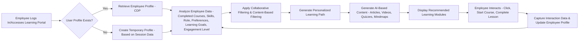
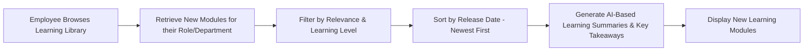
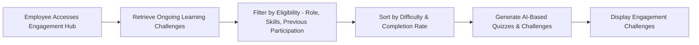
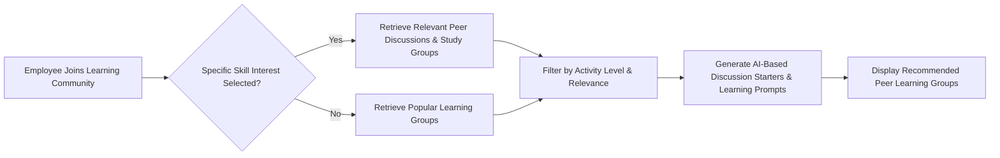
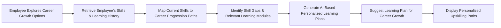

## Micro-learning Personalization & Employee Engagement Recommendation Flow with Gen AI

### 1. Personalized Learning Recommendations

**Mô tả:** Khi nhân viên truy cập vào nền tảng học tập, hệ thống sẽ kiểm tra hồ sơ cá nhân và phân tích dữ liệu học tập trước đó. Dựa trên thông tin này, AI sẽ tạo nội dung học tập phù hợp như bài viết, video, câu đố, sơ đồ tư duy và đề xuất các khóa học cá nhân hóa.

### 2. New Learning Modules (Role/Department Specific)

**Mô tả:** Khi nhân viên tìm kiếm nội dung học tập mới, hệ thống sẽ lọc các khóa học mới nhất phù hợp với vai trò và phòng ban của họ. AI sẽ tạo tóm tắt nội dung và rút ra các ý chính giúp nhân viên dễ dàng tiếp thu kiến thức.

### 3. Employee Engagement Challenges (Gamified Learning)

**Mô tả:** Hệ thống cung cấp các thử thách học tập theo phong cách game hóa, dựa trên vai trò và trình độ của nhân viên. AI sẽ tạo câu đố và thử thách phù hợp, giúp nhân viên tham gia học tập một cách hứng thú và nâng cao động lực.

### 4. Peer Learning & Social Collaboration

**Mô tả:** Nhân viên có thể tham gia vào các nhóm học tập cộng đồng và thảo luận theo chủ đề kỹ năng mà họ quan tâm. AI sẽ gợi ý các chủ đề thảo luận và nhóm học tập phù hợp để tối ưu hóa trải nghiệm học tập xã hội.

### 5. Career Growth & Upskilling Paths

**Mô tả:** Nhân viên có thể khám phá lộ trình phát triển sự nghiệp dựa trên kỹ năng hiện tại và khóa học đã hoàn thành. AI sẽ xác định các kỹ năng cần cải thiện, đề xuất khóa học phù hợp và xây dựng kế hoạch học tập cá nhân hóa để giúp họ thăng tiến trong công việc.

### Key Considerations with Gen AI:

- **CDP (Customer Data Platform for Employees):** Central hub storing employee learning profiles and engagement metrics.
- **AI-Generated Learning Content:** Automatically creating personalized articles, videos, quizzes, and mind maps.
- **Collaborative Filtering:** Recommending learning content based on what similar employees have completed or found useful.
- **Content-Based Filtering:** Suggesting courses based on an employee’s past learning activities and preferences.
- **Skill Progression Mapping:** Identifying career paths and required learning based on employee roles and future goals.
- **Gamification & Challenges:** Using engagement techniques like badges, leaderboards, and challenges to increase participation.
- **Social Learning:** Encouraging peer collaboration through discussion forums, study groups, and mentorship programs.
- **Real-time Updates:** Dynamic adjustments to recommendations based on employee interactions and learning behaviors.
- **A/B Testing:** Continuously optimizing learning pathways and recommendations based on employee engagement data.

This upgraded framework integrates Gen AI to enhance micro-learning experiences, improve content personalization, and drive employee engagement.

