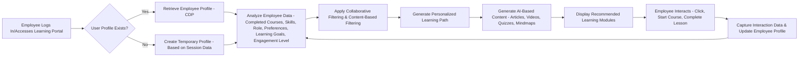
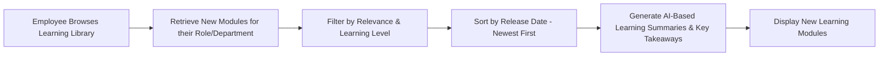
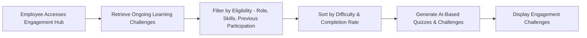
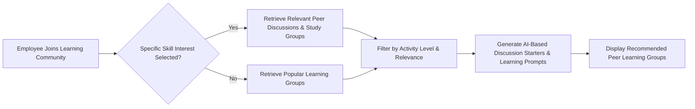
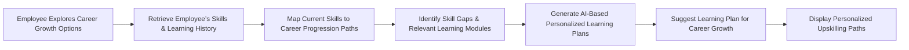

## Micro-learning Personalization & Employee Engagement Recommendation Flow with Gen AI

### 1. Personalized Learning Recommendations

### 2. New Learning Modules (Role/Department Specific)

### 3. Employee Engagement Challenges (Gamified Learning)

### 4. Peer Learning & Social Collaboration

### 5. Career Growth & Upskilling Paths

### Key Considerations with Gen AI:

- **CDP (Customer Data Platform for Employees):** Central hub storing employee learning profiles and engagement metrics.
- **AI-Generated Learning Content:** Automatically creating personalized articles, videos, quizzes, and mind maps.
- **Collaborative Filtering:** Recommending learning content based on what similar employees have completed or found useful.
- **Content-Based Filtering:** Suggesting courses based on an employee’s past learning activities and preferences.
- **Skill Progression Mapping:** Identifying career paths and required learning based on employee roles and future goals.
- **Gamification & Challenges:** Using engagement techniques like badges, leaderboards, and challenges to increase participation.
- **Social Learning:** Encouraging peer collaboration through discussion forums, study groups, and mentorship programs.
- **Real-time Updates:** Dynamic adjustments to recommendations based on employee interactions and learning behaviors.
- **A/B Testing:** Continuously optimizing learning pathways and recommendations based on employee engagement data.

This upgraded framework integrates Gen AI to enhance micro-learning experiences, improve content personalization, and drive employee engagement.
