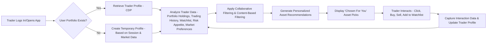
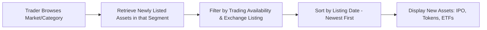
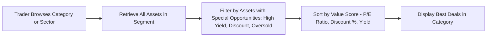
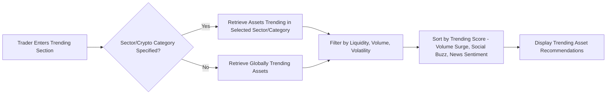
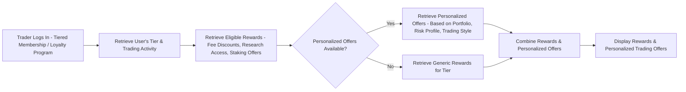

# FinTech Recommendation System – Asset Trading Use Cases

Here are activity diagrams for five FinTech recommendation use cases, focusing on **personalized asset trading recommendations** (stocks, crypto, ETFs).

---

## **1. Personalized Asset Picks (Chosen For You)**

---

## **2. New Listings / Market Debuts (IPO, New Tokens, ETFs)**

---

## **3. Best Deals (High Yield / Discounted Assets)**

---

## **4. Trending Assets (Market Buzz & Volume Spikes)**

---

## **5. Rewards & Personalized Offers (Loyalty / Premium Tiers)**

---

## **Key Explanations & Considerations (Finance Context):**

* **CDP (Customer Data Platform):** Central hub storing trader profiles, portfolios, watchlists, and behavioral history.
* **Collaborative Filtering:** Recommend assets that similar traders (with similar portfolio/risk) are buying or watching.
* **Content-Based Filtering:** Recommend assets based on a trader’s own history (e.g., tech stocks, DeFi tokens).
* **Trending Score:** Calculated from price momentum, trading volume, news sentiment, social buzz, on-chain metrics (for crypto).
* **Portfolio Fit:** Ensure recommendations align with trader’s **risk appetite, diversification goals, and liquidity needs**.
* **Real-time Updates:** Recommendations should adapt instantly to **market changes & user actions**.
* **A/B Testing:** Continuously test algorithms to improve conversion (e.g., % of recommended assets actually traded).

