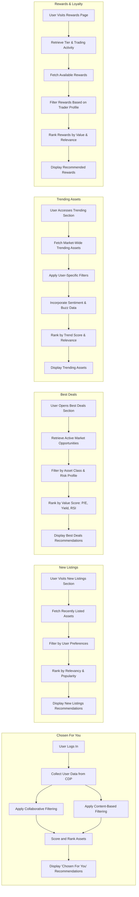

# FinTech Recommendation System – Asset Trading Use Cases

These activity diagrams illustrate how recommendation systems can enhance the **trader experience in stock and crypto markets**, driving engagement, retention, and better investment decisions.

---

### 1. **Chosen For You (Personalized Asset Picks)**

**Description**: Provides highly personalized asset recommendations based on a trader’s portfolio, watchlist, trading behavior, and risk profile.

**Activity Diagram**:

1. **User Logs into Trading App**

   * Trader accesses dashboard or portfolio page.
2. **Collect User Data from CDP**

   * Retrieve holdings, watchlist, trading history, risk appetite, and profile data.
3. **Apply Collaborative Filtering**

   * Identify similar traders and recommend assets that peers are buying, holding, or watching.
4. **Apply Content-Based Filtering**

   * Match user’s trading behavior (e.g., preference for tech stocks or DeFi tokens) with market data.
5. **Score and Rank Assets**

   * Combine collaborative and content-based results, weighted by risk-adjusted metrics (Sharpe ratio, volatility).
6. **Display "Chosen For You" Asset Recommendations**

   * Show top-ranked assets to the trader.

---

### 2. **New Listings (IPO, Token Launches, ETFs)**

**Description**: Highlights **newly listed assets** (IPOs, new ETFs, or crypto token launches) aligned with the trader’s interests.

**Activity Diagram**:

1. **User Visits New Listings Section**

   * Navigates to IPO/crypto launch feed.
2. **Fetch Recently Listed Assets**

   * Pull data on IPOs, ETFs, or token launches from market feeds.
3. **Filter by User Preferences**

   * Narrow results by sectors (tech, healthcare), asset type (stocks, crypto), and trading style.
4. **Rank by Relevancy and Early Popularity**

   * Rank listings using signals like pre-IPO buzz, token presale demand, or analyst ratings.
5. **Display New Listings Recommendations**

   * Show ranked results tailored to the trader.

---

### 3. **Best Deals (Undervalued / High Yield Opportunities)**

**Description**: Surfaces assets currently undervalued or offering strong income potential (dividends, staking yields).

**Activity Diagram**:

1. **User Opens Best Deals Section**

   * Trader browses “Opportunities” tab.
2. **Retrieve Active Market Opportunities**

   * Pull undervalued stocks (low P/E, P/B) or crypto with high staking/APY offers.
3. **Filter by User’s Asset Class & Risk Profile**

   * Adjust to match preferences (e.g., growth vs. income, low vs. high risk).
4. **Rank Opportunities by Value Score**

   * Sort based on metrics like RSI, dividend yield, on-chain activity, or analyst upside %.
5. **Display Best Deals Recommendations**

   * Show the most relevant opportunities for the trader.

---

### 4. **Trending Assets (Market Buzz & Momentum)**

**Description**: Suggests assets that are trending based on **trading volume, volatility, sentiment, and news**.

**Activity Diagram**:

1. **User Accesses Trending Section**

   * Navigates to “Hot Stocks” or “Trending Crypto.”
2. **Fetch Market-Wide Trending Assets**

   * Gather assets with unusual activity (volume spikes, volatility).
3. **Apply User-Specific Filters**

   * Filter by sectors, exchanges, or risk levels matching the user.
4. **Incorporate Sentiment & Popularity Data**

   * Factor in news, analyst coverage, social media buzz, on-chain signals (crypto).
5. **Rank by Trend Score & Relevance**

   * Rank assets using a momentum/trending score.
6. **Display Trending Asset Recommendations**

   * Present hottest assets tailored to the trader.

---

### 5. **Rewards & Loyalty (Tiered Trader Benefits)**

**Description**: Suggests redeemable rewards, discounts, or perks for traders, based on loyalty status and activity.

**Activity Diagram**:

1. **User Visits Rewards Page**

   * Trader opens loyalty or premium section.
2. **Retrieve Tier & Trading Activity**

   * Fetch user’s membership tier, trading fees paid, and activity level.
3. **Fetch Available Rewards**

   * Gather rewards like fee discounts, free research, staking offers, or API credits.
4. **Filter by Trader Profile**

   * Personalize rewards by asset class traded, frequency, or style.
5. **Rank Rewards by Value & Relevance**

   * Rank using estimated savings or utility.
6. **Display Recommended Rewards**

   * Show most relevant loyalty benefits to the trader.

---

### **Unified Activity Diagrams in Finance (Mermaid)**

