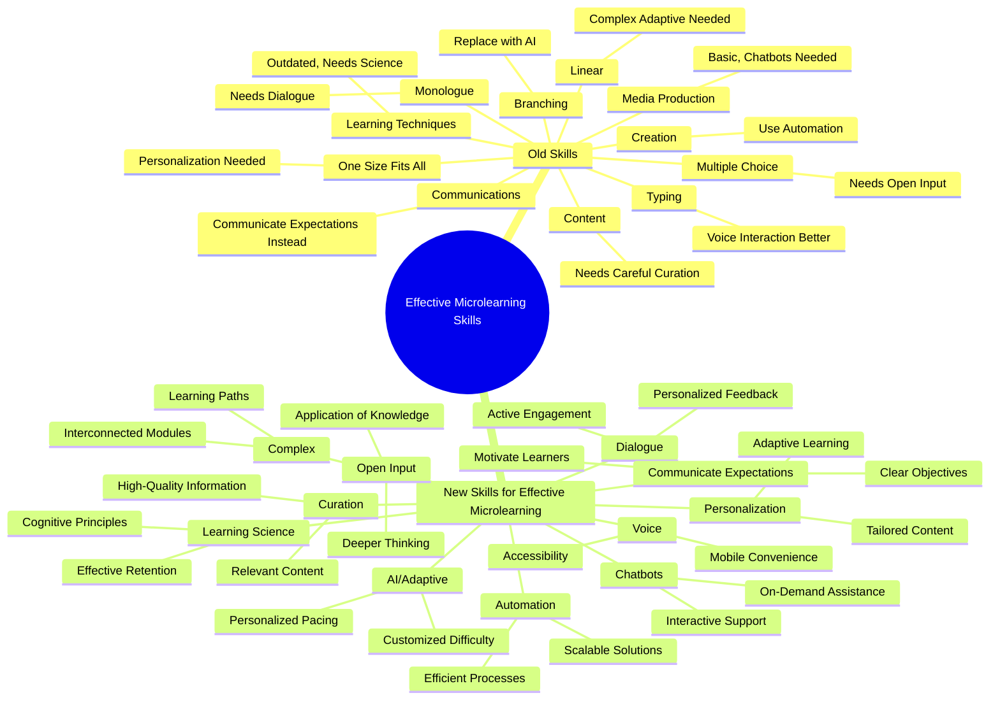

# Effective Microlearning Skills

```mermaid
mindmap
  root((Effective Microlearning Skills))
      Old Skills
        One Size Fits All
          Personalization Needed
        Learning Techniques
          Outdated, Needs Science
        Media Production
          Basic, Chatbots Needed
        Monologue
          Needs Dialogue
        Typing
          Voice Interaction Better
        Multiple Choice
          Needs Open Input
        Linear
          Complex Adaptive Needed
        Branching
          Replace with AI
        Content
          Needs Careful Curation
        Communications
          Communicate Expectations Instead
        Creation
          Use Automation

      New Skills for Effective Microlearning
        Personalization
          Tailored Content
          Adaptive Learning
        Learning Science
          Cognitive Principles
          Effective Retention
        Chatbots
          Interactive Support
          On-Demand Assistance
        Dialogue
          Active Engagement
          Personalized Feedback
        Voice
          Accessibility
          Mobile Convenience
        Open Input
          Deeper Thinking
          Application of Knowledge
        Complex
          Interconnected Modules
          Learning Paths
        AI/Adaptive
          Personalized Pacing
          Customized Difficulty
        Curation
          Relevant Content
          High-Quality Information
        Communicate Expectations
          Clear Objectives
          Motivate Learners
        Automation
          Efficient Processes
          Scalable Solutions
```